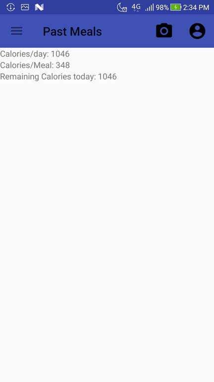

# SnapFood
A food recognition Android app that allows users to track the calories they consume and provides intelligent food suggestions based on their diet.

## Functionalities
* Users can take pictures of their foods on the camera page within the app.
* The app can recognize the foods from the pictures.
* The app provides an interface that displays the meals in an organized list fashion.
* Users can add a new meal or delete an existing meal in the list.
* The app can return precise nutrition facts information of the meals in the list.
* Users can input their body information, personalized calories goals, and time given for maintaining the diet.
* The app can accurately display the calories of each meal.
* The app can calculate the recommended number of calories the users have left and update it whenever new meals are generated.
* The app can give appropriate suggestions to the user about the foods they should try based on personal preferences of certain types of foods and their calorie budgets.

## Technologies Used
The mobile application is built in Java for the Android mobile platform using the Android Studio IDE.
For food recognition, the Tensorflow library is utilized.
The nutrition facts for the foods are acquired through online by using the WolframAlpha API.

## Food Recognition
The food recognition model is created on top of the Inception Model by transfer learning and trained specifically on the different categories of foods from the Food-101 dataset.
The model is trained on a laptop with processor i7-4720HQ, 12 GB of RAM, and graphics card GTX950M. It is trained for around 8 hours.
The resulting accuracy is 50% to 60% and can be increased should the model be trained for a longer period of time.

